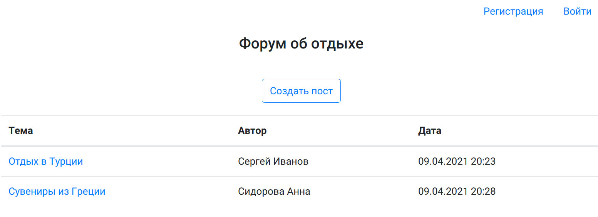
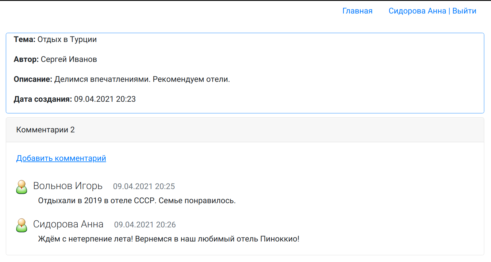
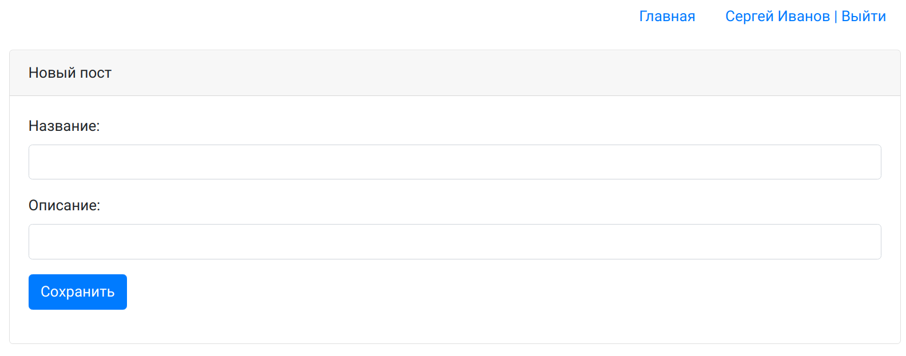
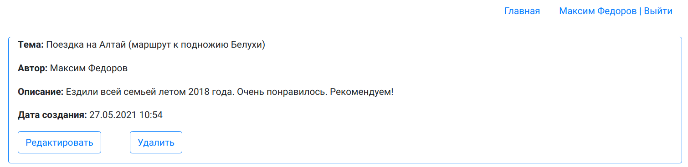
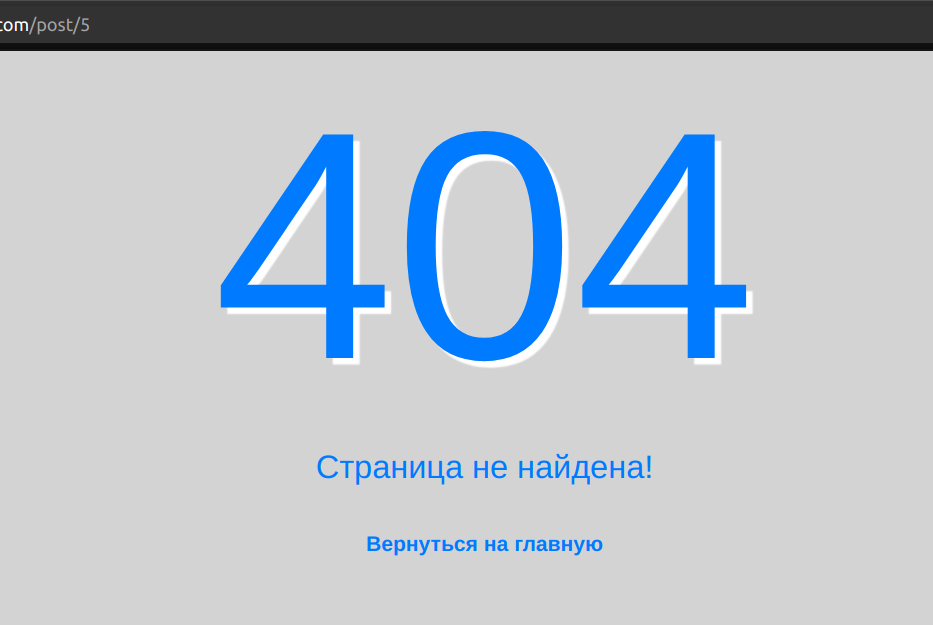
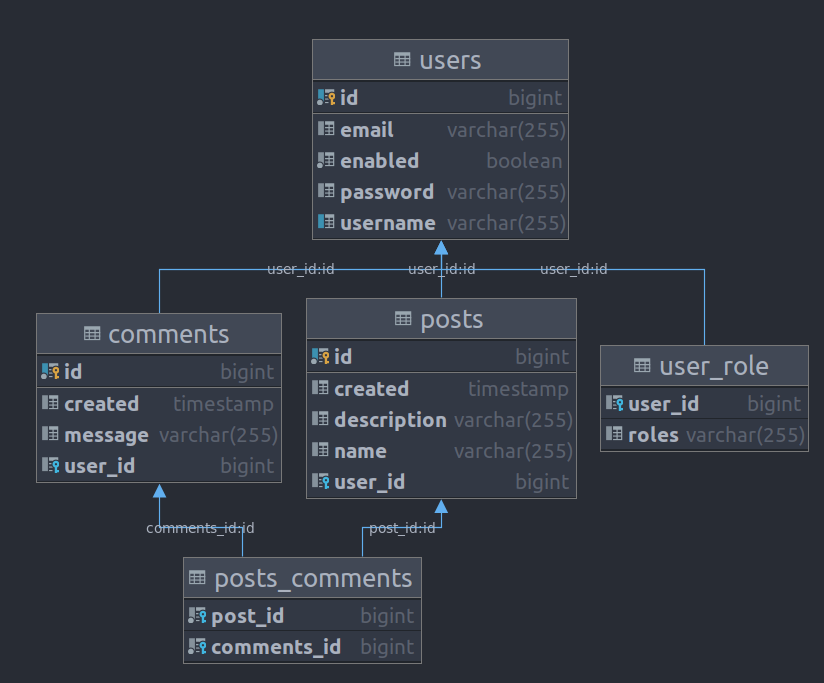

# Форум

Посмотреть проект:
https://immense-shore-93521.herokuapp.com/

### Описание
Простой интернет-форум. Позволяет добавлять
посты, отвечать на них. Также содержит регистрацию пользователей и
авторизацию.

### Технологии:

* Spring Boot 2
* Spring Security
* Spring MVC
* Spring Data
* Java 11
* PostgreSQL 11
* Liquibase
* JSP/JSTL
* Apache Tomcat
* CSS, Bootstrap
* Maven
* Junit Tests
* Travis CI

### Функциональность

__Главная страница__

__Страница поста с комментариями__

__Создание нового поста__

__Добавление комментария__ 

__Редактирование поста__ 

__Страница регистрации__ 

__Страница авторизации__ 

__Страница не найдена__ 

__Схема базы данных__ 
